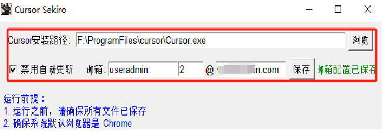
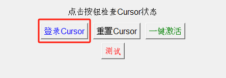
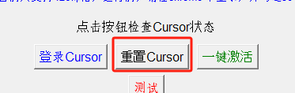
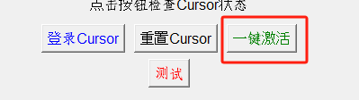

# Cursor 无限试用工具

一个自动化工具，用于实现 Cursor 编辑器的无限试用功能。

## 项目地址

- gitee
    https://gitee.com/ccpp/cursor_sekiro
- github
    https://github.com/moonciki/cursor_sekiro

## Cursor 历史版本
#### 如果激活不成功，尝试使用历史版本
[Cursor 历史版本](./doc/help/md/cursor_history_version.md)

## 前置条件
- 本工具只支持windows 系统，其他系统未做测试
- 系统需安装chrome 浏览器，且需要将系统默认浏览器改成chrome
- 使用 OpenCV 做图像识别，自动化激活流程
- 登录邮箱必须使用 126 邮箱，如需使用其他邮箱，请自行适配
- 系统分辨率不能设置缩放，否则会影响识别
- 系统不要调色，否则会影响识别

## 环境要求
- Python 3.11.9
- 操作系统：Windows

## 项目运行
### 项目运行需要管理员权限

#### 直接运行
- 直接下载 release 包，解压后运行
- 运行时，需要管理员权限
#### 编译运行
```bash
# 安装依赖
python install_requirements.py
# 编译
python setup.py build
# 运行
python main.py
```


## 使用方法
1. 目前只支持主题：现代浅色 default light Modern，所以需要先将cursor设置为该主题
2. 使用默认浏览器，必须是chrome，登录 126 邮箱，并勾选30天免登录，该邮箱后续作为登录邮箱


3. 以管理员方式运行本工具

4. 先保存邮箱配置。




5. 如需单独登录账号，点击登录cursor



6. 如需单独重置机器码，点击重置Cursor（该步骤不限制邮箱及浏览器类型）



7. 一键激活



#### 打赏
* 您的支持就是我的动力，如果觉得本工具对你有帮助，可以三连或打赏支持一下（不支持也没关系）
<div align="center">
<table>
<tr>

<td align="center">
<b>微信赞赏</b><br>
<br>
<small>要到饭咧？啊咧？不给也没事~ 请随意打赏</small>
</td>
<td align="center">
<b>支付宝赞赏</b><br>
<br>
<small>如果觉得有帮助,来包辣条犒劳一下吧~</small>
</td>

</tr>
</table>
</div>

## 联系方式

<div align="center">
<table>
<tr>
<td align="center">
<b>公众号</b><br>
<br>
<small>获取更多资源</small>
</td>
<td align="center">
<b>B站地址</b><br>
<a href="https://b23.tv/rJRHSmG">https://b23.tv/rJRHSmG</a>
<small>三连也可以~</small>
</td>
</tr>
</table>
</div>


## 操作过程中请勿移动鼠标或操作键盘
## 如需提前终止操作，可以使用热键CTRL+Q（必须先选中激活工具窗口），或者挪动鼠标、更改窗口等方式使操作终止

## 如需适配Cursor其他主题，可以通过替换 resources/images/button/ 下的图片来适配


