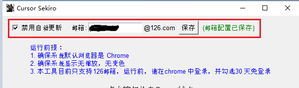
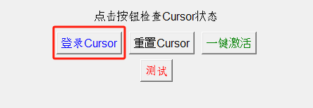
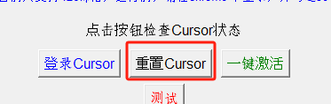
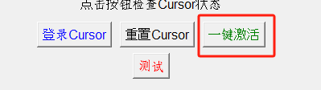

# Cursor 无限续杯工具

一个自动化工具，用于实现 Cursor 编辑器的无限续杯功能。

## 前置条件
- 本工具只支持windows 系统，其他系统未做测试
- 系统需安装chrome 浏览器，且需要将系统默认浏览器改成chrome
- 使用 OpenCV 做图像识别，自动化激活流程
- 登录邮箱必须使用 126 邮箱，如有需要，请自行适配
- 系统分辨率没有缩放，否则会影响识别
- 系统不要调色，否则会影响识别

## 环境要求
- Python 3.11.9
- 操作系统：Windows

## 项目运行
### 项目运行需要管理员权限

#### 直接运行
- 直接下载 release 包，解压后运行
- 运行时，需要管理员权限
#### 编译运行
```bash
# 安装依赖
python install_requirements.py
# 编译
python setup.py build
# 运行
python main.py
```


## 使用方法
1. 目前只支持主题：现代浅色 default light Modern，所以需要先将cursor设置为该主题
2. 使用默认浏览器，必须是chrome，登录 126 邮箱，并勾选30天免登录，该邮箱后续作为登录邮箱

3. 以管理员方式运行本工具
4. 先保存邮箱配置。

5. 如需单独登录账号，点击登录cursor

6. 如需单独重置机器码，点击重置Cursor（该步骤不限制邮箱及浏览器类型）

7. 一键激活


## 操作过程中请勿移动鼠标或操作键盘
## 如需提前终止操作，可以使用热键CTRL+Q（必须先选中激活工具窗口），或者挪动鼠标、更改窗口等方式使操作终止

## 如需适配Cursor其他主题，可以通过替换 resources/images/button/ 下的图片来适配

## 参考文档
https://github.com/yuaotian/go-cursor-help

