# 邮件路由转发配置指南

## 前期准备
1. 准备一个域名(任意域名均可)
2. 登录 [Cloudflare 控制台](https://dash.cloudflare.com/)

## Cloudflare DNS 转发配置

### 1. 添加域名

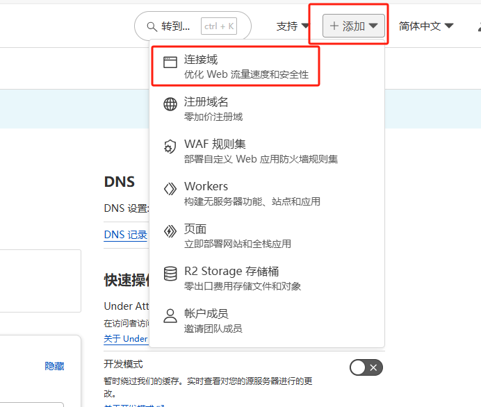

### 2. DNS扫描

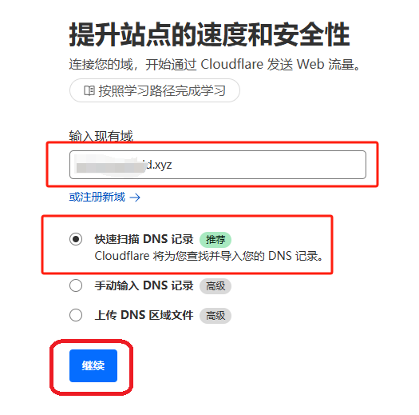

### 3. 选择计划

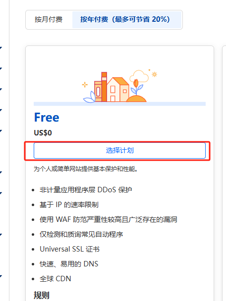

### 4. 激活配置

直接点击"继续前往激活"即可

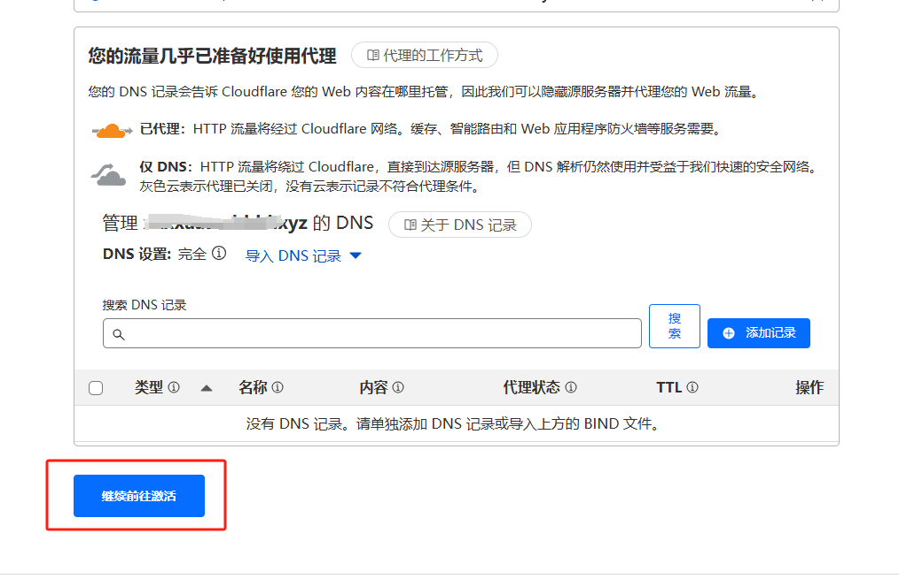

### 5. 获取DNS地址

请记录下图中显示的两个DNS地址，后续配置需要使用

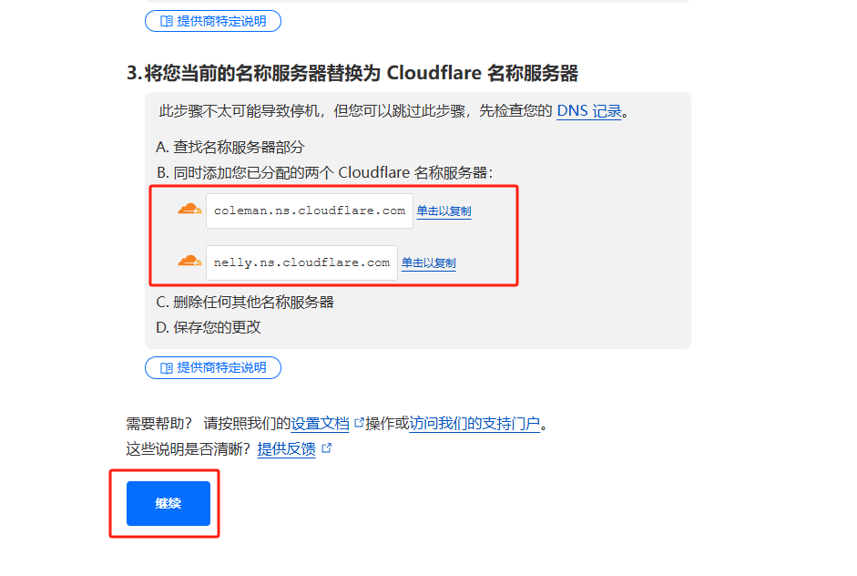

### 6. 更新域名DNS设置

> **注意**: 由于Cursor是国外服务，国内DNS可能无法正常访问，因此需要切换到Cloudflare的DNS。
> 此操作可能会影响域名解析，如果域名正在使用中，请谨慎操作。

### 7. 域名DNS配置

进入域名管理界面，修改DNS配置

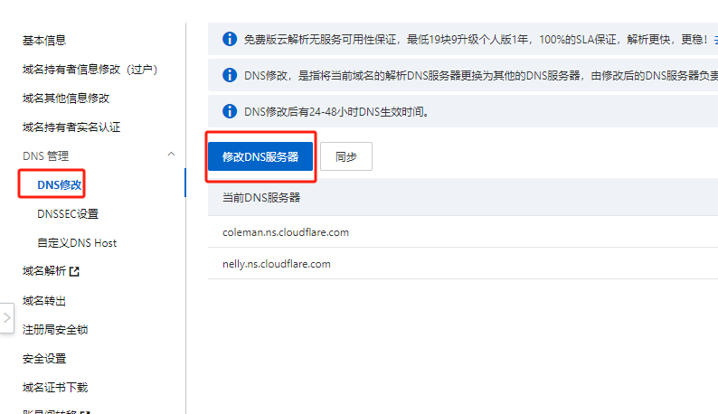

### 8. 更新DNS记录

将之前获取的两个DNS地址填入并保存

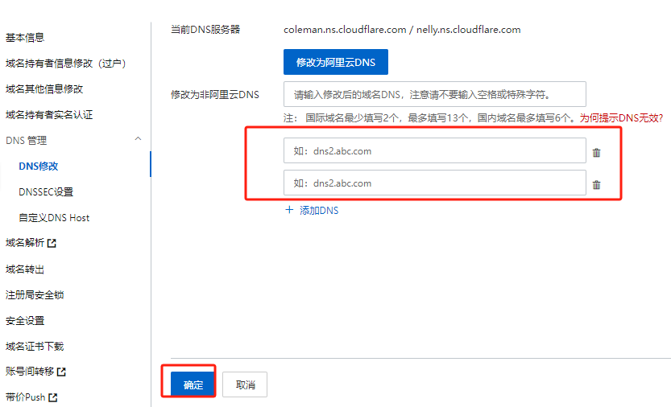

### 9. 验证DNS生效

返回Cloudflare检查域名DNS是否生效（通常需要等待几十分钟）

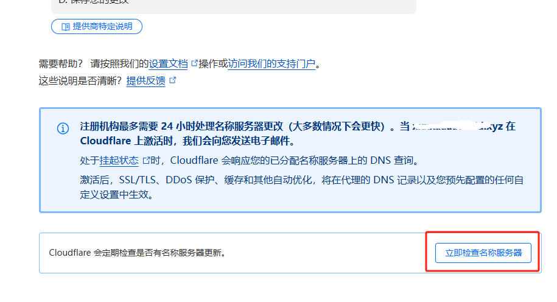
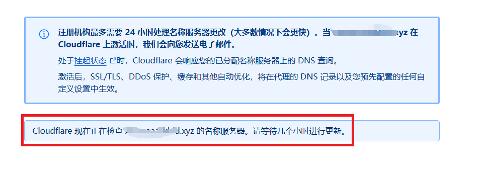

## 邮件转发路由配置

### 1. 开启邮件路由

进入邮件路由设置，点击"开始使用"

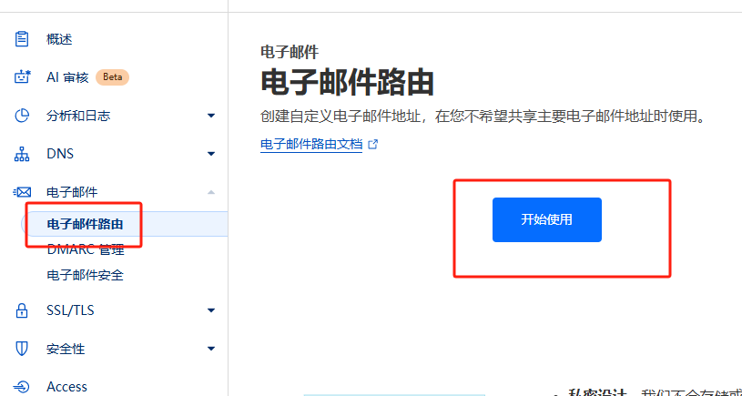

### 2. 配置转发地址

- 输入自定义地址
- 选择目标转发邮箱（示例使用126邮箱）
- 点击创建继续

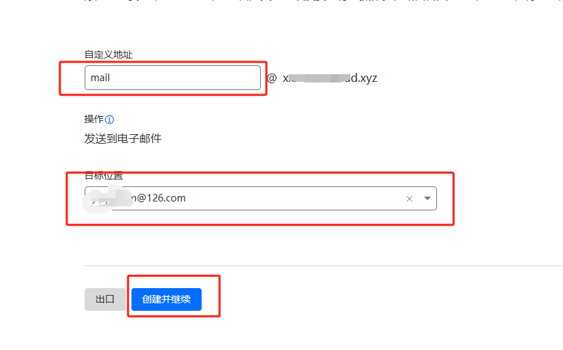

### 3. 确认设置

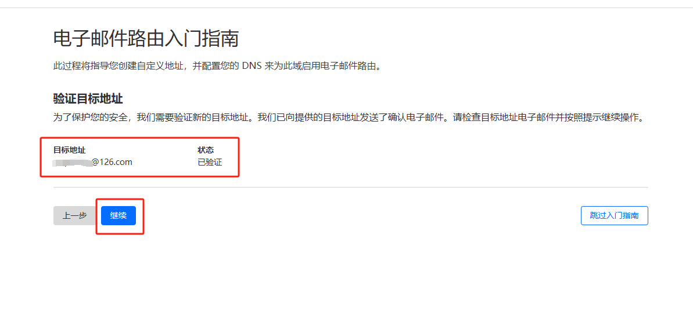

### 4. 启用记录

添加记录并启用配置

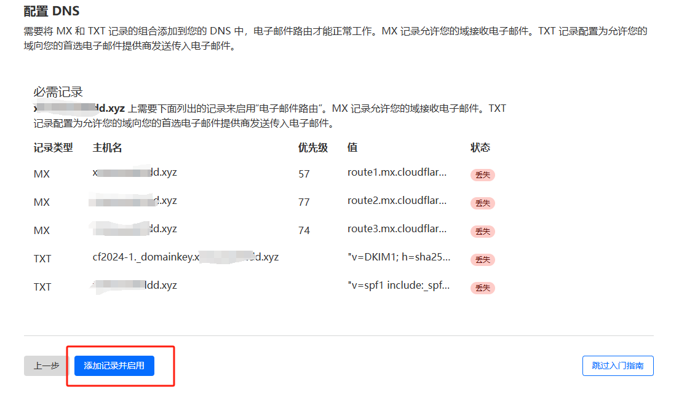

### 5. 配置Catch-All规则

点击路由规则，启用Catch-All规则并进行编辑

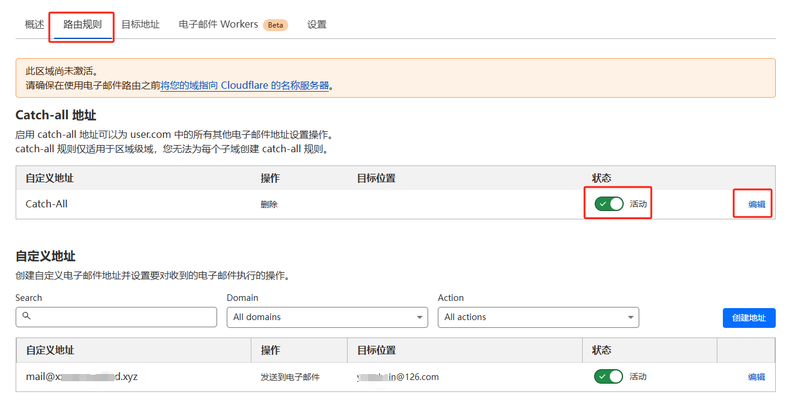

### 6. 设置转发规则

- 将操作设置为"发送到电子邮件"
- 设置目标位置为之前配置的邮箱
- 保存设置

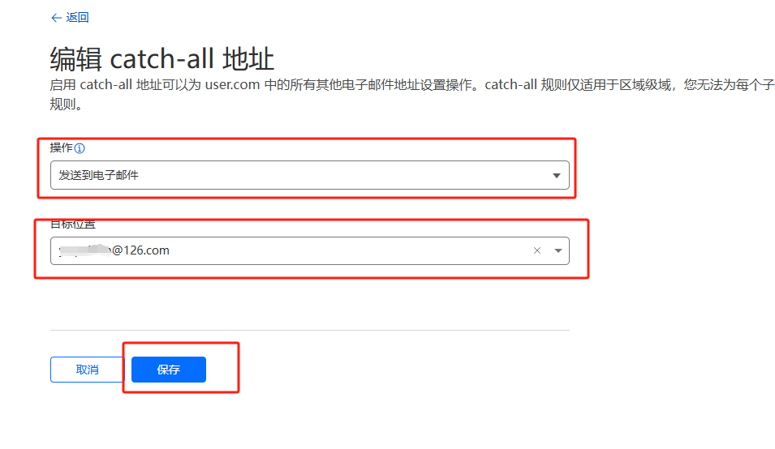

### 7. 测试转发功能

使用任意邮箱向你的域名发送测试邮件：
- 收件地址格式：`任意名称@你的域名`
- 邮件将自动转发至你设置的目标邮箱
